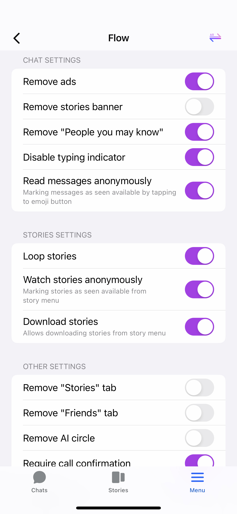
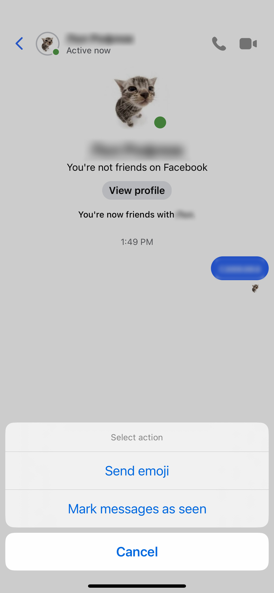

# Flow for Messenger
A lightweight Messenger enhancer

## Screenshots
<table>
   <tr>
      <td></td>
      <td></td>
      <td></td>
   </tr>
</table>

## Features
<li>Remove ads</li>
<li>Remove stories banner</li>
<li>Remove 'People you may know'</li>
<li>Disable typing indicator</li>
<li>Read messages anonymously</li>
<li>Watch stories anonymously</li>
<li>Loop stories</li>
<li>Download stories</li>
<li>Remove 'Stories' tab</li>
<li>Remove 'Friends' tab</li>
<li>Remove AI circle</li>
<li>Require call confirmation</li>
 